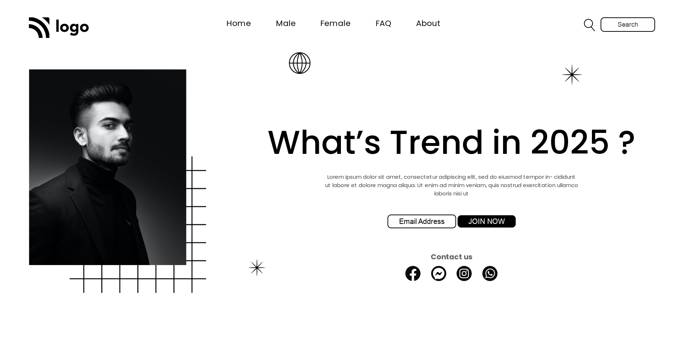

# Nishok Maharaaj

## Learnings  

The first project in the class and I have learnt so much about positioning in CSS. Came accross different properties in CSS such as Z-index which is majorly used in the image in landing page.

This project primarily focuses on the position property in CSS

## Efforts

This project took around 2 hours to build along with lot of research and google since its the very first project.

### Screenshot

